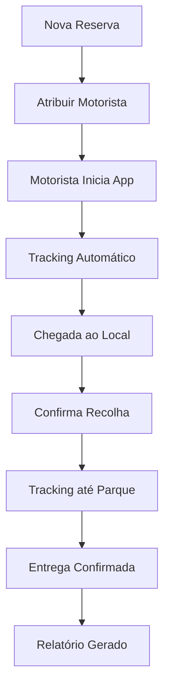

# 📋 Documento de Integração: GNR 2.0 Dashboard → Sistema Multipark

## 📊 Análise Executiva

### Visão Geral
A aplicação GNR 2.0 é um **Dashboard de Análise de Percurso** que utiliza tecnologias avançadas de geolocalização para monitorizar e analisar trajetos de veículos. Esta ferramenta tem potencial significativo para melhorar a operação de recolhas/entregas do sistema Multipark.

### Valor para o Negócio
- **Redução de custos** com combustível (otimização de rotas)
- **Controlo de qualidade** do serviço de motoristas
- **Segurança** e conformidade com limites de velocidade
- **Dados analíticos** para tomada de decisão
- **Responsabilização** dos colaboradores

---

## 🎯 Casos de Uso no Sistema Multipark

### 1. **Monitorização de Recolhas/Entregas**
```javascript
// Cenário: Motorista faz recolha de veículo no aeroporto
- Tracking GPS em tempo real
- Verificação de rota mais eficiente
- Controlo de velocidade (segurança do veículo do cliente)
- Tempo de percurso (SLA com cliente)
```

### 2. **Análise de Desempenho de Motoristas**
- Ranking de motoristas mais eficientes
- Identificação de comportamentos de risco
- Base para sistema de bonificações
- Formação direcionada

### 3. **Prova de Serviço**
- Evidência GPS para clientes
- Resolução de disputas
- Relatórios automáticos de entrega
- Transparência total do serviço

---

## 🔧 Plano de Integração Técnica

### Fase 1: Preparação da Infraestrutura (Semana 1-2)

#### 1.1 Base de Dados (Supabase)
```sql
-- Criar tabelas necessárias
CREATE TABLE tracking_sessions (
    id UUID PRIMARY KEY DEFAULT uuid_generate_v4(),
    reservation_id UUID REFERENCES reservas(id),
    driver_id UUID REFERENCES users(id),
    vehicle_plate VARCHAR(20),
    start_time TIMESTAMP WITH TIME ZONE,
    end_time TIMESTAMP WITH TIME ZONE,
    total_distance DECIMAL(10,2),
    max_speed INTEGER,
    incidents_count INTEGER,
    status VARCHAR(50) DEFAULT 'active',
    created_at TIMESTAMP WITH TIME ZONE DEFAULT NOW()
);

CREATE TABLE tracking_points (
    id UUID PRIMARY KEY DEFAULT uuid_generate_v4(),
    session_id UUID REFERENCES tracking_sessions(id),
    latitude DECIMAL(10,8),
    longitude DECIMAL(11,8),
    speed DECIMAL(5,2),
    accuracy DECIMAL(5,2),
    road_speed_limit INTEGER,
    timestamp TIMESTAMP WITH TIME ZONE,
    is_incident BOOLEAN DEFAULT FALSE
);

CREATE TABLE tracking_incidents (
    id UUID PRIMARY KEY DEFAULT uuid_generate_v4(),
    session_id UUID REFERENCES tracking_sessions(id),
    point_id UUID REFERENCES tracking_points(id),
    incident_type VARCHAR(50), -- 'speeding', 'route_deviation', 'stop_unauthorized'
    severity VARCHAR(20), -- 'low', 'medium', 'high'
    speed_recorded INTEGER,
    speed_limit INTEGER,
    excess_speed INTEGER,
    location_name TEXT,
    notes TEXT
);
```

#### 1.2 API Endpoints
```typescript
// app/api/tracking/route.ts
export async function POST(req: Request) {
    // Iniciar sessão de tracking
}

export async function PUT(req: Request) {
    // Atualizar pontos GPS
}

export async function GET(req: Request) {
    // Obter dados de tracking
}
```

### Fase 2: Adaptação do Frontend (Semana 3-4)

#### 2.1 Criar Nova Página no Sistema
```tsx
// app/tracking/page.tsx
import TrackingDashboard from '@/components/tracking/Dashboard'

export default function TrackingPage() {
    return (
        <Layout>
            <TrackingDashboard />
        </Layout>
    )
}
```

#### 2.2 Componentes React
```typescript
// components/tracking/Dashboard.tsx
- Mapa em tempo real
- Lista de motoristas ativos
- Alertas de incidentes
- Estatísticas do dia
```

### Fase 3: Sistema de Captura GPS (Semana 5-6)

#### 3.1 App Mobile para Motoristas
```javascript
// Opções:
1. PWA (Progressive Web App)
   - Funciona em qualquer dispositivo
   - Acesso a GPS via browser
   - Notificações push
   
2. React Native App
   - Melhor performance
   - Background tracking
   - Integração nativa com GPS
```

#### 3.2 Tracking Automático
```javascript
// Pseudo-código para tracking
navigator.geolocation.watchPosition(
    (position) => {
        sendToSupabase({
            lat: position.coords.latitude,
            lng: position.coords.longitude,
            speed: position.coords.speed,
            accuracy: position.coords.accuracy,
            timestamp: new Date()
        })
    },
    { enableHighAccuracy: true, maximumAge: 1000 }
);
```

### Fase 4: Integração com Workflow Existente (Semana 7-8)

#### 4.1 Fluxo de Recolha com Tracking


#### 4.2 Notificações e Alertas
```javascript
// Alertas em tempo real
- Excesso de velocidade > 20km/h
- Desvio de rota > 1km
- Parada não autorizada > 10min
- Aproximação do destino
```

---

## 💡 Funcionalidades Propostas

### Must-Have (MVP)
1. ✅ **Tracking GPS básico** durante recolhas/entregas
2. ✅ **Visualização em mapa** do percurso
3. ✅ **Deteção de incidentes** de velocidade
4. ✅ **Relatório por viagem**
5. ✅ **Histórico por motorista**

### Nice-to-Have
1. 🔄 **Otimização de rotas** com IA
2. 🔄 **Estimativa de chegada** para clientes
3. 🔄 **Gamificação** para motoristas
4. 🔄 **Integração com seguradoras**
5. 🔄 **Análise preditiva** de manutenção

### Future Vision
1. 🚀 **Fleet Management completo**
2. 🚀 **Integração com IoT** dos veículos
3. 🚀 **Machine Learning** para previsões
4. 🚀 **Blockchain** para certificação de entregas

---

## 📈 KPIs e Métricas

### Métricas Operacionais
```javascript
const kpis = {
    // Eficiência
    tempoMedioPorRecolha: "minutos",
    distanciaMediaPorDia: "km",
    combustivelPorKm: "litros",
    
    // Segurança
    incidentesPor100km: "número",
    velocidadeMediaExcesso: "km/h",
    
    // Qualidade
    desviosDeRota: "percentagem",
    pontualidade: "percentagem",
    
    // Financeiro
    custoPorRecolha: "euros",
    economiaCombutivel: "euros/mês"
}
```

### Dashboard Analytics
- **Real-time**: Veículos em movimento
- **Daily**: Resumo de operações
- **Weekly**: Tendências e padrões
- **Monthly**: Relatórios executivos

---

## 🔐 Considerações de Segurança e Privacidade

### RGPD Compliance
```typescript
// Requisitos RGPD
- Consentimento explícito dos motoristas
- Dados anonimizados após 30 dias
- Direito ao esquecimento
- Exportação de dados pessoais
- Logs de acesso auditáveis
```

### Segurança dos Dados
- Encriptação em trânsito (HTTPS)
- Encriptação em repouso (Supabase)
- Autenticação two-factor para admin
- Rate limiting nas APIs
- Backup automático diário

---

## 💰 Análise de Custos e ROI

### Custos de Implementação
```
Desenvolvimento: 
- 8 semanas x 40h = 320 horas
- Custo estimado: €12,000 - €16,000

Infraestrutura (mensal):
- Supabase Pro: €25/mês
- OpenStreetMap API: Gratuito
- SMS/Notificações: €50/mês
- Total: ~€75/mês
```

### ROI Esperado
```
Economias (mensal):
- Combustível (10% redução): €500
- Tempo (15% mais eficiente): €800
- Multas evitadas: €200
- Total: €1,500/mês

Payback: ~10 meses
```

---

## 📅 Cronograma de Implementação

### Timeline Proposto
```
Semana 1-2:  [██████░░░░] Setup Base de Dados
Semana 3-4:  [░░████░░░░] Frontend Adaptação
Semana 5-6:  [░░░░████░░] Sistema GPS
Semana 7-8:  [░░░░░░████] Integração Final
Semana 9-10: [░░░░░░░░██] Testes e Deploy
```

### Milestones
1. **M1**: Database schema completo
2. **M2**: Tracking básico funcional
3. **M3**: Interface integrada
4. **M4**: Sistema em produção
5. **M5**: Primeiros relatórios

---

## 🚀 Quick Wins Imediatos

### Implementação Rápida (1 semana)
1. **Copiar o HTML** existente para uma página no sistema
2. **Adicionar autenticação** básica
3. **Guardar dados** no localStorage inicialmente
4. **Teste piloto** com 1-2 motoristas
5. **Feedback** e iteração

### Código para Começar Já
```typescript
// app/tracking-poc/page.tsx
'use client'

import { useEffect, useState } from 'react'
import { supabase } from '@/lib/supabase'

export default function TrackingPOC() {
    const [tracking, setTracking] = useState(false)
    const [points, setPoints] = useState([])
    
    const startTracking = () => {
        navigator.geolocation.watchPosition(
            async (position) => {
                const point = {
                    lat: position.coords.latitude,
                    lng: position.coords.longitude,
                    speed: position.coords.speed * 3.6, // m/s to km/h
                    timestamp: new Date()
                }
                
                // Guardar no Supabase
                await supabase.from('tracking_points').insert(point)
                
                setPoints(prev => [...prev, point])
            },
            null,
            { enableHighAccuracy: true }
        )
    }
    
    return (
        // Interface aqui
    )
}
```

---

## ✅ Próximos Passos

### Ações Imediatas
1. **Aprovar** conceito com stakeholders
2. **Definir** prioridades de features
3. **Selecionar** motorista piloto
4. **Criar** branch no GitHub
5. **Iniciar** desenvolvimento

### Checklist de Preparação
- [ ] Reunião com equipa de motoristas
- [ ] Verificar requisitos legais
- [ ] Preparar ambiente de desenvolvimento
- [ ] Definir KPIs de sucesso
- [ ] Estabelecer processo de feedback

---

## 🎯 Conclusão

A integração desta tecnologia de tracking no sistema Multipark representa uma **oportunidade significativa** para:
- Modernizar as operações
- Aumentar a eficiência
- Melhorar a segurança
- Reduzir custos
- Diferenciar-se da concorrência

Com um investimento relativamente baixo e um prazo de implementação de 8-10 semanas, o sistema pode estar operacional e a gerar valor imediato.

**Recomendação**: Iniciar com um POC (Proof of Concept) de 2 semanas com funcionalidades básicas e expandir baseado nos resultados.

---

*Documento preparado por: Claude*
*Data: 16/09/2025*
*Versão: 1.0*